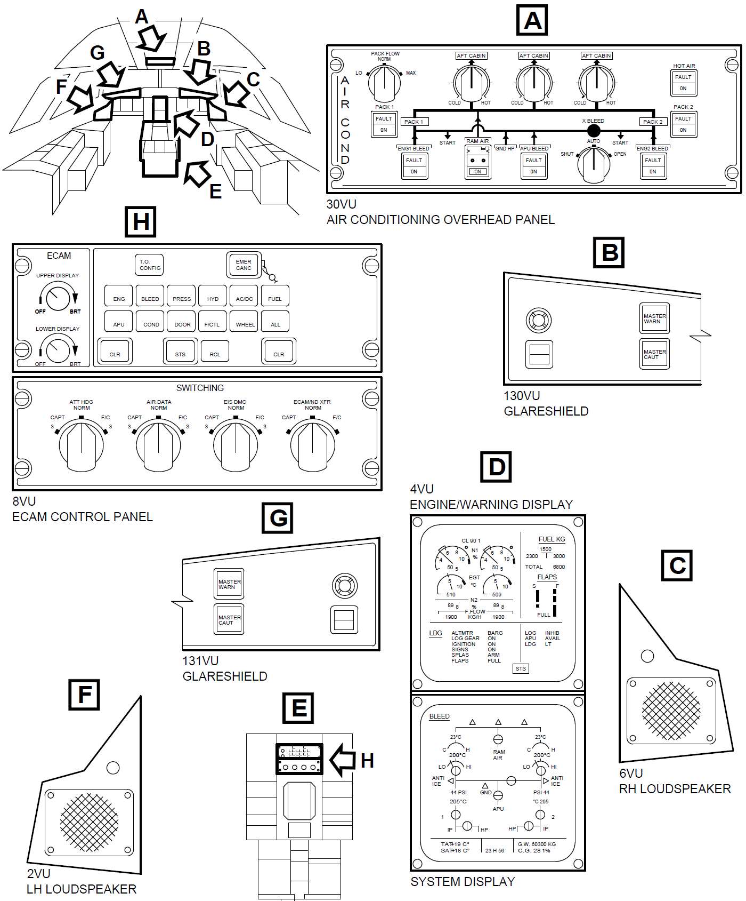

# 00-概述

## 介绍

空气系统(引气系统)提供高压空气，以保障飞机的某些系统或功能正常工作，这些系统或功能包括：

- 大翼防冰系统
- 空调系统
- 发动机启动系统
- 液压油箱增压系统
- 水增压系统
- 发动机短舱防冰活门的伺服增压

&emsp;&emsp;两个`引气监控计算机`Bleed-Air Monitoring Computer(`BMC`)负责监控和管理引气系统，正常情况下，引气系统由`BMC`自动控制，但是也可以通过驾驶舱头顶面板`30VU`上的一些按钮或旋钮来人工控制。  
&emsp;&emsp;SD的引气页面上可以看到一些工作参数和状态。  
&emsp;&emsp;CFDS里提供了对BMC的BITE测试和引气系统的相关维护数据。

## 10-子系统 - 分配

分配子系统将引气来源的引气提供给[用户们](#介绍)。  
分配子系统又分为三大引气源和环境防护四个子系统。

### 引气来源

引气系统有三大引气来源：

- [左右发动机引气(CFM56)](./11.md)，发动机引气是飞行中的主要引气来源
- [APU引气](./12.md)，APU引气是地面上的主要引气来源，当然，在飞行高度不高于20000ft时，APU也可以在飞行中提供引气
- [地面高压气源](./12.md)，在地面上，地面高压气源可以代替APU引气使用，它通过地面高压接头直接将空气引入管道

### 环境保护

- 大翼前缘防护
- 发动机吊架防护
- 发动机短舱防护

## 20-子系统 - 指示

指示子系统又分为以下子系统：

- 压力和温度监控
- 渗漏探测

指示系统监监控：

- 管道的压力和温度
- 阀门的位置
- 安装在管道上或挨着管道安装的超温传感元件

## 供电

&emsp;&emsp;引气系统的供电来自飞机的直流电系统(28V DC)，直流电系统通过`2HA1`、`2HA2`、`3HA1`、`3HA2`这四个跳开关将直流电供给：

- BMC
- 头顶空调面板的继电器
- 头顶火警面板
- 压力传感器