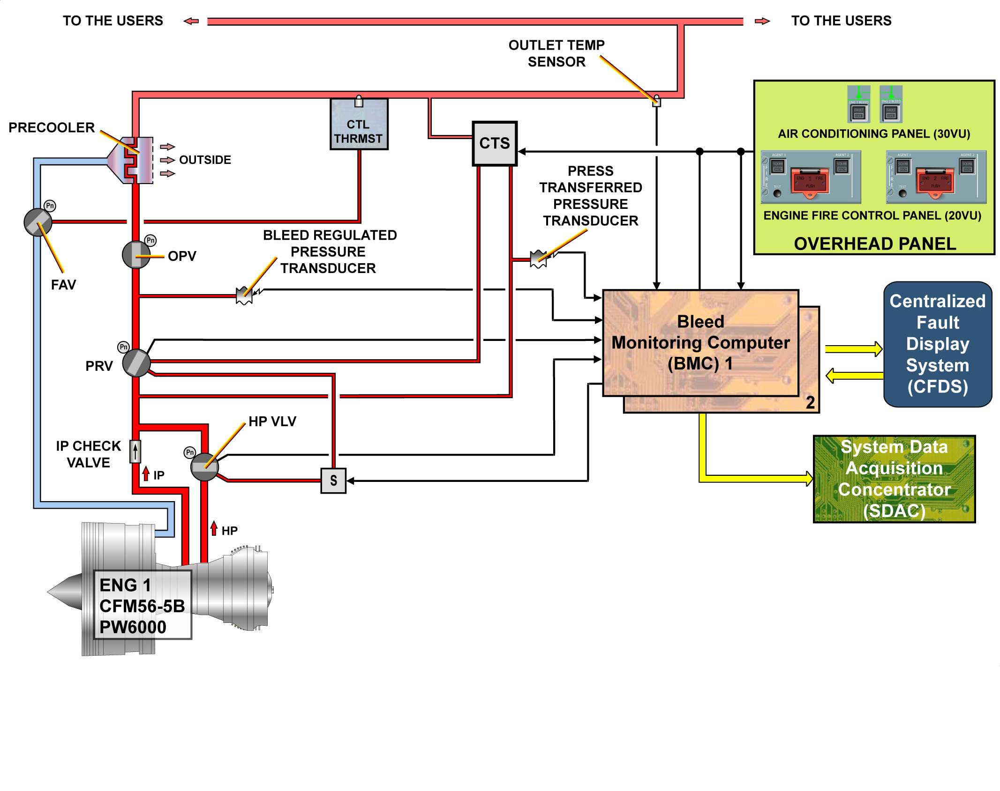
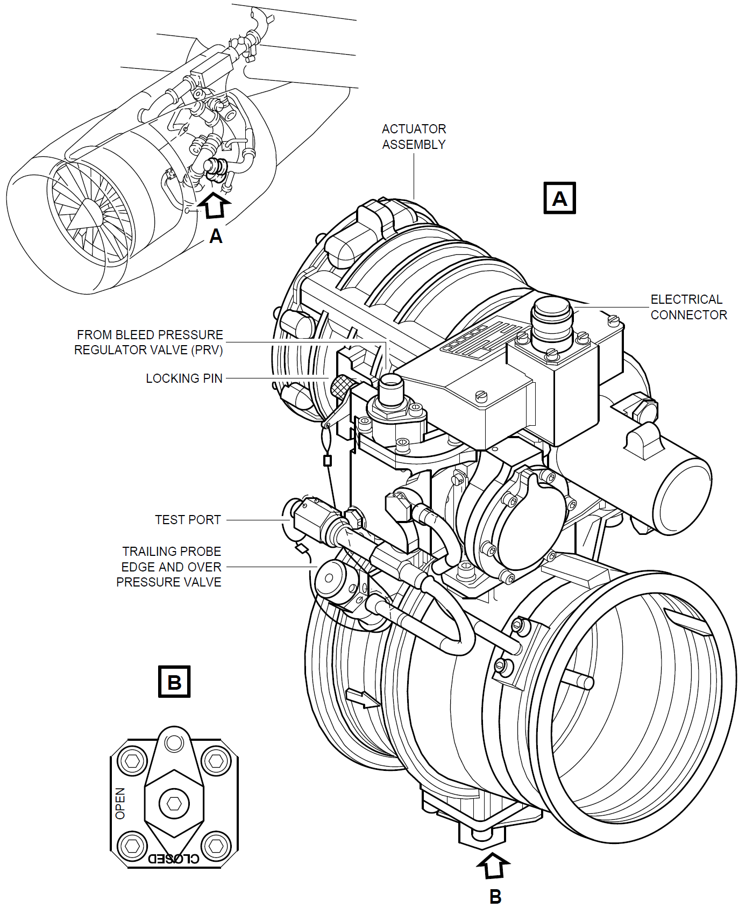
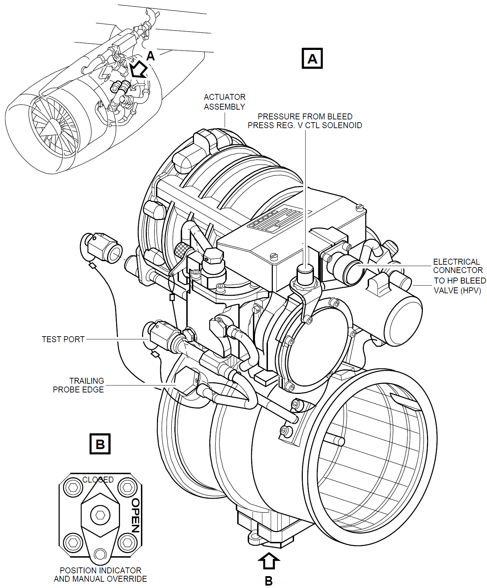
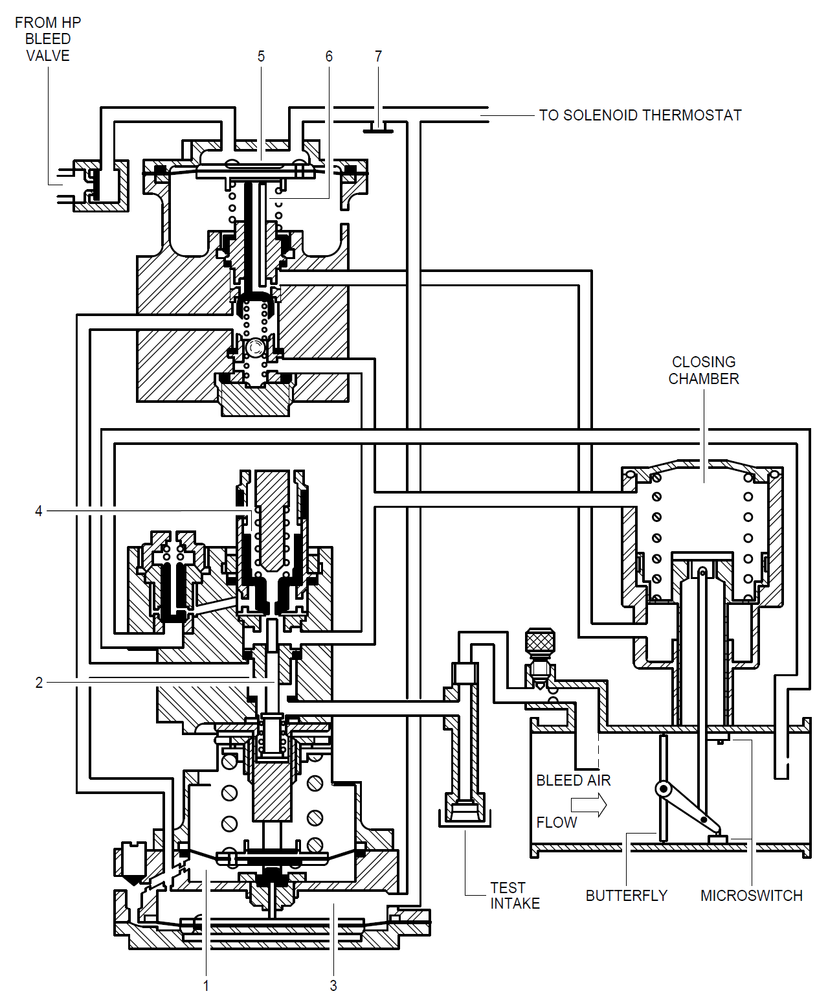
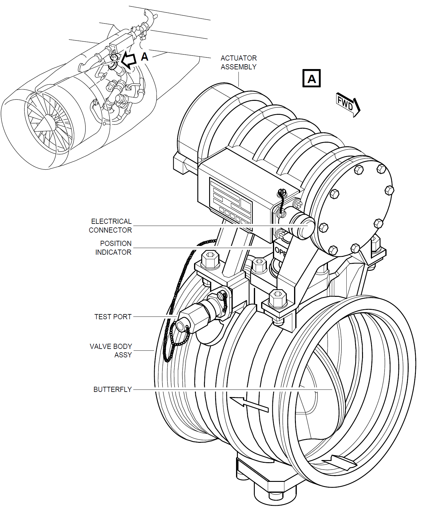
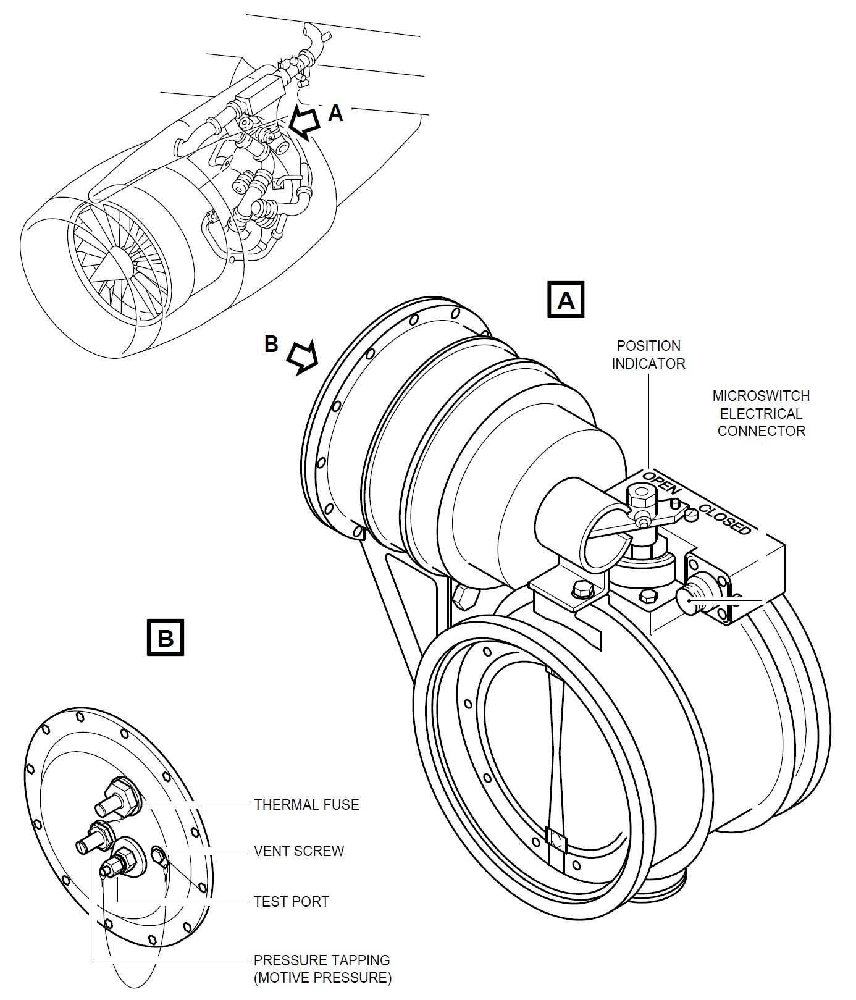
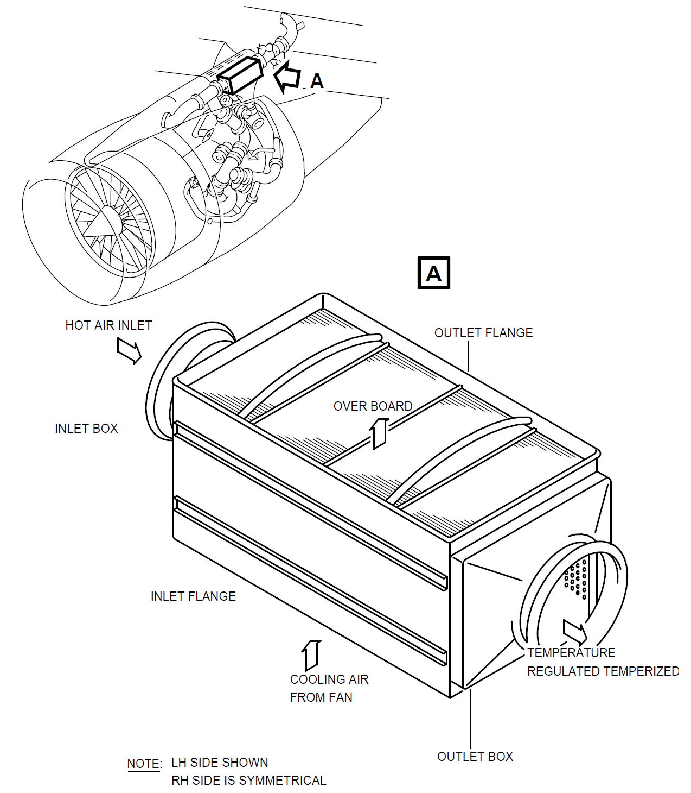

# 11-发动机引气(CFM56)

只有发动机引气可以在引气时进行压力调节。

上图为左发的示意图，从图中看到，发动机引气有几个关键部件：

- 高压引气活门 - `HPV`
- 中压单向活门 - `IPCV`
- 压力调节活门 - `PRV`
- 超压活门 - `OPV`
- 风扇引气活门 - `FAV`
- 预冷器

&emsp;&emsp;发动机可以通过HPV从压气机的高压级引气，也可以通过IPCV从压气机的中压级引气。  
&emsp;&emsp;对于CFM56发动机来说，高压级为第9级，中压级为第5级。  
&emsp;&emsp;当发动机处于低功率状态时，通过HPV引出；当中压级压力足够时，HPV会关闭，这时通过IPCV引出。  
&emsp;&emsp;在HPV和IPCV的下游装有一个PRV，引出的空气会通过PRV进行压力调节，当通过HPV引气时，HPV和PRV都能调节压力；当通过IPCV引气时，由于IPCV仅仅是个普通的单向活门，不具备调压的功能，因此这时只能通过PRV调压。  
&emsp;&emsp;OPV在PRV的下游，当OPV的上游压力达到或超过一定阈值时，OPV会关闭，这样就能防止超压的空气继续流向下游(分配管道)。  
&emsp;&emsp;FAV将外涵道的风扇低温空气引向预冷器，预冷器安装在OPV的下游，它是一个风冷式的热交换器(预冷器的降温作用有限)。  
&emsp;&emsp;空气在预冷器降温以后，就会流向分配管道，分配管道将空气分配给各个用户。

## HPV

&emsp;&emsp;HPV是一个电控气动的蝶形阀，当它的上游气压不足时，由于弹簧负载的作用而处于关闭状态。  
&emsp;&emsp;在发动机开始启动至慢车位的过程中，由于转速较低，导致压气机前几级的压力较低，无法提供足够的引气压力，所以，空气得从压气机压力较高的后几级中抽出。  
&emsp;&emsp;CFM56发动机是在压气机的第9级（高压级）抽取空气，在发动机的加速过程中，当高压级的压力达到至少8psi时，作用在HPV阀门上的力超过弹簧的力，从而HPV的蝶形阀被压力顶开，空气开始进入管道。  

&emsp;&emsp;HPV的口子并不会完全打开，蝶形阀开到满位时也只能打开大约一半的口子让空气通过，这样设计的目的是为了让HPV能够调节其下游的空气静压，这个静压最高不能超过36psi(允许向下偏差3psi)，显然，高压级的压力越大，蝶形阀的开度就越大，下游的静压也就越高，因此，`HPV能调节的下游静压在8~36psi`。  
&emsp;&emsp;当HPV的上游静压达到`120psi`(允许向下偏差10psi，向上偏差5psi)时，HPV又会完全关闭，HPV和PRV之间有连接了一根感压管，PRV在关闭时通过这根感压管来强制关闭HPV。  
**有关HPV的详细的工作原理，请参见[HPV工作原理](./11hpv.md)**
::: warning 注意
对于使用CFM56和PW6000发动机的A318/A319，在飞行中BMC会让HPV一直保持在关闭状态。
:::
::: warning 注意
&emsp;&emsp;对于使用老款引气设计的CFM56发动机，由于较低的中压级压力会使得HPV一直打开，其推力燃油比(`TSFC`)会增大。  
&emsp;&emsp;为了避免这种情况发生，在吊架的悬臂上装有一个电磁阀，它通过一根感压管连接到PRV-HPV感压管，在巡航中正常引气条件下，BMC通过控制这个电磁阀来使HPV关闭：

- 高度大于15000ft
- 大翼防冰不在ON位
- 正常引气状态(2 bleeds, 2 packs)
- Ps3达到至少85psi(AMM上是85psi，2013版空客教材上是80psi)
- P0低于7.65psi

:::

## IPCV

&emsp;&emsp;IPCV是一个普通的单向活门，它不能调节压力，当高压级引气时，空气倒流至IPCV的下游时，在压差作用下，阀门关闭，从而防止空气倒流回压气机的中压级。  
当CFM56发动机的压气机第5级(中压级)的压力足够引气时，HPV就会关闭，发动机从中压级引气，从而减少压气机的能量损失。

## PRV

&emsp;&emsp;PRV是一个气动的蝶形阀，通常由弹簧负载保持在关位，当PRV的上游压力达到至少8psi时，PRV才能打开。  
&emsp;&emsp;PRV调节其下游压力在44±1.75psi。  
::: warning 注意
对于使用老款引气设计的CFM56发动机，PRV调节其下游压力在44±3psi，具体以AMM为准。
:::

PRV会在以下情况下自动关闭(电控模式)：

- 预冷器的下游至少连续60秒超温达到257±3℃
- PRV的下游至少连续15秒超压达到57±3psi
- 吊架/大翼/机身的管道周围附近过热
- APU引气活门未关闭
- 相应的发动机的起动机活门未关闭

PRV也会由于机组执行某些动作而关闭(电控模式)：

- 释放发动机火警电门
- 关闭发动机引气

&emsp;&emsp;PRV的气控模式只有一种功能：逆向气流保护，当探测到预冷器的出口和PRV的进口之间有压差时，即即将发生倒流时，PRV会关闭，防止反向气流。
&emsp;&emsp;PRV的阀体里还装有热熔丝，当发动机温度到达450±25℃时(失火)，PRV也会关闭。  
**有关PRV的详细的工作原理，请参见[PRV工作原理](./11prv.md)**

## OPV

&emsp;&emsp;OPV是一个气动的蝶形阀，通常由弹簧负载保持在开位。OPV完全靠气动，它不能从驾驶舱里控制。  
&emsp;&emsp;OPV在其上游压力达到75psi时，开始关闭，达到85psi时，完全关闭，35psi左右时，又会重新打开。

::: warning 注意
上面是在空客2013版教材中的OPV的开关阈值，实际上对于不同件号的OPV，其阈值是不一样的，例如：

- P/N: 6740B05xxxx，81~85psi时开始关闭，超过85psi时，完全关闭，小于50psi时，重新打开
- P/N: 6740E01xxxx，81~85psi时开始关闭，超过85psi时，完全关闭，20~57.20psi时，重新打开
- P/N: 6740F01xxxx，81~85psi时开始关闭，超过85psi时，完全关闭，29~56psi时，重新打开
- P/N: 6740B03xxxx，79.78~85.57psi时开始关闭，84.13~89.92psi时，完全关闭，34.95psi时，重新打开
- P/N: 6740B01xxxx，55psi时开始关闭，34.95psi时，重新打开

**请以AMM中的值为准**
:::

## FAV和预冷器

&emsp;&emsp;FAV是一个气控蝶形阀，通常由弹簧负载保持在关位，当其上游压力达到至少8psi时，才会打开。  

&emsp;&emsp;FAV和预冷器配合，将预冷器下游的空气温度控制在200±15℃。  
