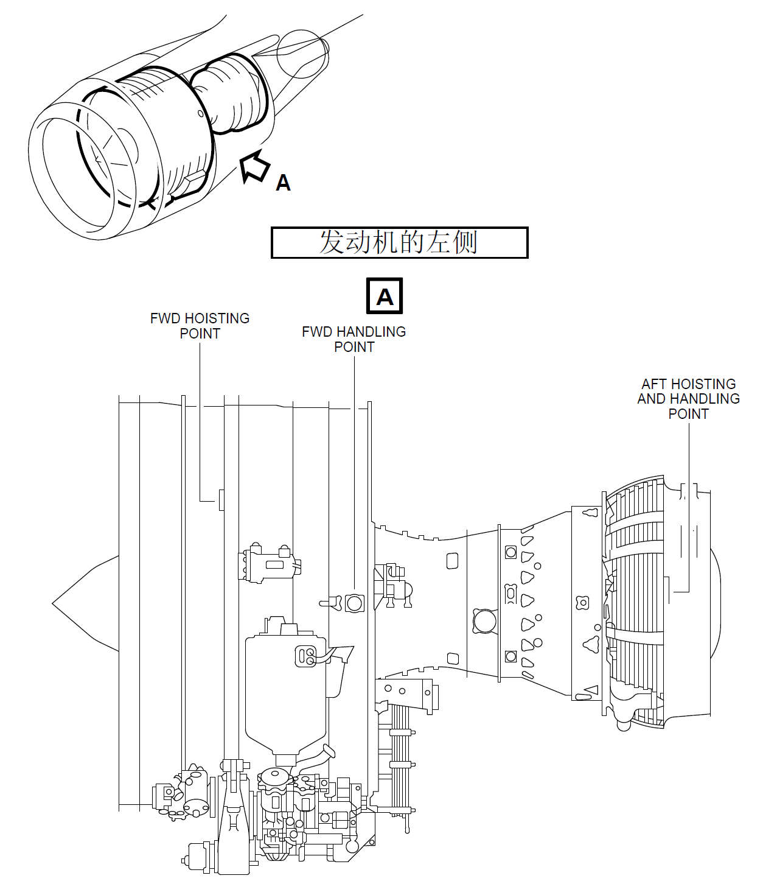
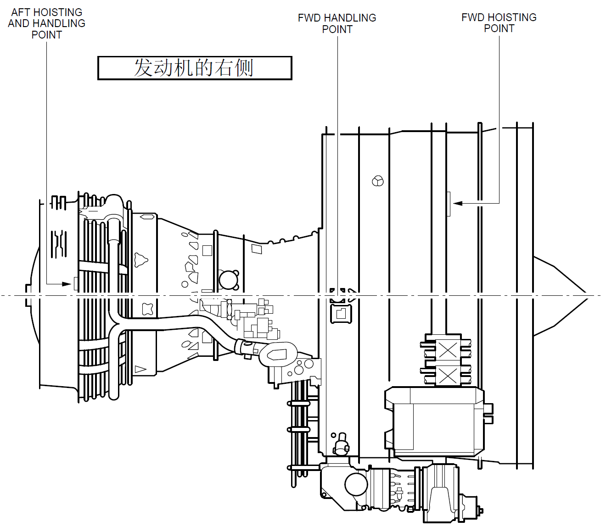
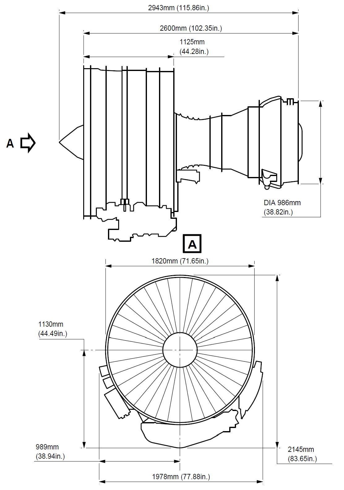

# 72-00 发动机

## 1、简介

CFM56-5B涡扇发动机特点：

- 双转子
- 可调静子
- 高涵道比

高压压气机(共9级)由高压涡轮驱动(共1级)，风扇和增压器(低压压气机)由低压涡轮驱动(4级)。发动机上的附件由高压转子提供能量驱动。

## 2、发动机的几大模块

- 风扇/增压器(低压压气机)转子
- 风扇/增压器(低压压气机)静子
- 风扇框
- (高压)压气机转子
- (高压)压气机静子
- 燃烧室
- 高压涡轮
- 低压涡轮
- 涡轮框
- 附件及其驱动

## 3、轴承和密封

## 4、孔探