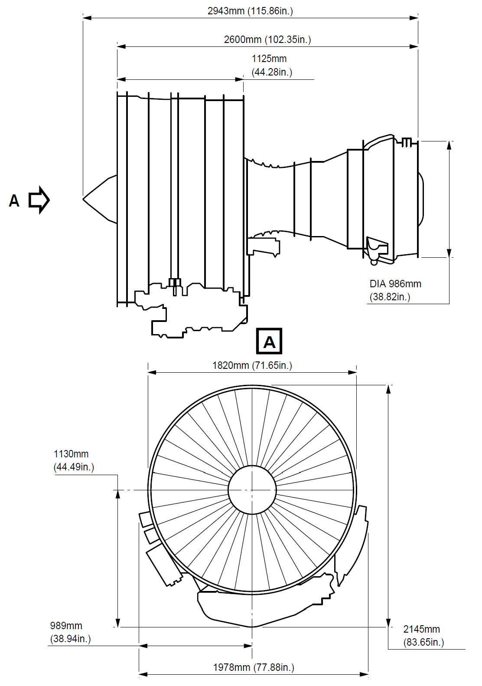

# 72-00 发动机

## 1、简介

CFM56-5B涡扇发动机特点：

- 双转子
- 可调静子
- 高涵道比

高压压气机(共9级)由高压涡轮驱动(共1级)，风扇和增压器(低压压气机)由低压涡轮驱动(4级)。发动机上的附件由高压转子提供能量驱动。

## 2、发动机的几大模块

- 风扇/增压器(低压压气机)转子
- 风扇/增压器(低压压气机)静子
- 风扇框
- (高压)压气机转子
- (高压)压气机静子
- 燃烧室
- 高压涡轮
- 低压涡轮
- 涡轮框
- 附件及其驱动

## 3、轴承和密封

## 4、孔探

1. General (Ref. Fig. Engine LH Side SHEET 1)  (Ref. Fig. Engine RH Side SHEET 1)  (Ref. Fig. Engine Schematic SHEET 1)  (Ref. Fig. Major External Dimensions SHEET 1)  The engine is a dual-rotor, variable stator, high bypass ratio turbo fan power plant. The 9 stage high pressure compressor is driven by 1 stage high pressure turbine, and the integrated front fan and booster is driven by 4 stage low pressure turbine. An annular combustor converts fuel and compressor discharge air into energy to provide engine thrust part through primary exhaust and to drive the turbines. The accessory drive system extracts energy from the high pressure rotor to drive the engine accessories and the engine mounted aircraft accessories. Reverse thrust for braking the aircraft after landing is supplied by an integrated system which acts on the fan discharge airflow (Ref. 78-00-00). 2. Engine Modules The principal modules of the engine are fan and booster, high pressure compressor, combustor chamber, high pressure turbine, low pressure turbine and accessory drive gearbox. Detailed descriptions of the components of each section are given in corresponding sections of this document. The description of each engine module is as follows: A. Fan/Booster Rotor The fan rotor consists of one full diameter booster for the secondary flow single stage fan and a smaller 4 Stage booster for the core engine flow. The fan and the booster are mounted on a common internal concentric shaft driven by the fan pressure turbine. Two bearings support the fan assembly in the frame. B. Fan/Booster Stator Fixed stator vanes are provided for both, the fan and booster rotor. The fan casing, in which the stator is mounted has provision for blade containment forward of and in the plan of the fan rotor. The casing is supported by the fan frame and supports the accessory drive gearbox. C. Fan Frame The fan frame is one of the major structural and aerodynamic components of the engine. Aerodynamically the fan frame forms the inner and outer flow passage of the fan airstream as well as the core airstream. Structurally, it carries inlet cowl loads, supports the fan casing, the two fan bearings and the core engine forward bearing; it contains the forward engine mount, it houses the accessory drive power take off gearbox and radial drive shaft; it contains the variable bypass valves between the booster and high pressure compressor; it supports the transfer and accessory gearboxes; and provides the mounting surfaces for fan-stream acoustic panels. The fan frame also serves as the forward support for the compressor. D. Compressor Rotor The compressor is a nine stage axial flow assembly. The rotor consists of the stage 1 and 2 discs which form a spool, a separately attached stage 3 disc and a spool containing stage 4 - 9 discs. Stage 1, 2 and 3 have axial dovetail slots and stage 4 - 9 blades are retained in circumferential slots. All blades are individually replaceable without spool disassembly. E. Compressor Stator All 9 stages of the compressor stator are shrouded. The Inlet Guide Vanes (IGV) and the first 3 stages of the compressor are variable. The casing is composed of two semi cylindrical halves, permitting a quick access to the core engine compressor. F. Combustor A step diffuser is incorporated upstream of the combustor for reduction of the combustor sensitivity to the compressor velocity profile. The combustor can be replaced without disturbing the fuel nozzles. The combustor casing provides structural support for the combustor, the compressor Outlet Guide Vanes (OGV) the High Pressure (HP) stator and shrouds, and the seals for Compressor Discharge Pressure (CDP). G. High Pressure Turbine The High Pressure Turbine (HPT) is an air cooled single stage high energy turbine. Rotor blades are individually replaceable without the need for rotor disassembly or rebalancing. H. Low Pressure Turbine The Low Pressure Turbine (LPT) consists of 4 and half stages of blades and vanes. The first stage nozzle vane is cooled and provides cooling air for the high pressure and low pressure turbine discs. The LPT drives the fan rotor through the inner concentric shaft and is aerodynamically coupled to the high pressure system. The LPT casing is a 360 degrees design to provide structural continuity. J. Turbine Frame The turbine frame is located aft the LPT. It contains the aft LPT bearing, and supports the primary exhaust system. It contains the engine rear mount fitting. K. Accessories and Accessory Drives Engine and aircraft accessories are mounted on the accessory gearbox which is located on the outside of the lower part of the casing and driven through a radial shaft at 6 o'clock position. Power for the engine and aircraft accessories is extracted from the HPC rotor shaft through an inlet gearbox and the radial drive shaft. Quick Attach/Detach (QAD) accessory mounting flanges are provided for the engine accessories. 3. Bearings and Seals (Ref. Fig. Forward Sump SHEET 1)  (Ref. Fig. Aft Sump SHEET 1)  (Ref. Fig. Sump Venting System SHEET 1)  A. Bearings The engine rotors are supported by bearings installed in the sump cavities provided by the two frames. The forward sump is in the fan frame and is the location of bearings No. 1, No. 2 (fan/booster shaft) and No. 3 (HP shaft forward part). The aft sump is in the turbine rear frame where are bearings No. 4 (HP shaft aft part) and No. 5 (LP shaft aft part). B. Oil Distribution The bearings must be lubricated and oil is distributed to these components by nozzles. However, the oil must be retained within the engine, so seals of various types are provided to confine the oil and direct its recirculation. C. Seals Arrangement The arrangement of oil and air seals, the provisions for oil supply, oil scavenge, seal pressurization, sump vent subsystems produce a system known as a dry sump. Engine sumps are vented to ambient pressure through the "center-vent" tube which is contained in the LP shaft. D. Bearing Functions Bearings provide reduced rolling friction, support the rotors axially and radially within the engine structure, and position the rotors relative to the stators. The bearing must control the forces of gravity weight aerodynamic loads of pumping and turbine driving and gyroscopic loads due to aircraft maneuvers. 4. Engine Boroscope Inspection Port Provisions, Location and Identification (Ref. Fig. Engine Borescope Port Provisions - Location and Identification on Left Side SHEET 1)  (Ref. Fig. Engine Borescope Port Provisions - Location and Identification on Right Side SHEET 1)  (Ref. Fig. Borescope Port Provisions - Location and Engine Station SHEET 1)  There is a total of 22 borescope port provisions along the engine. The most important number of them is found on the engine right side, mostly between the 4 and 5 o'clock positions, aft looking forward. Their location and identification are as follows: A. On the Inner Wall (Fairing) of the Fan Bypass Duct (Ref. Fig. Engine Borescope Port Provisions - Location and Identification on Left Side SHEET 1)  There are two (8 mm dia) borescope port provisions. From front to rear, the first port, identified S03, is just below the 3 o'clock position, between two OGVs. The second port, identified S05, is near the 4 o'clock position, just in front of the Variable Bleed Valves (VBVs) plane. Refer to ATA 72-21-00 for the internal parts and areas you can fully or partially see through these two borescope port provisions. B. On the High Pressure Compressor (HPC) Front and Rear Casings (Ref. Fig. Engine Borescope Port Provisions - Location and Identification on Right Side SHEET 1)  (Ref. Fig. Borescope Port Provisions - Location and Engine Station SHEET 1)  There are nine (8 and 10 mm dia) borescope port provisions, located between the 4 and 5 o'clock positions, aft looking forward. From the HPC inlet plane IGV to the last stage (ninth) of the HPC, they are identified as follows: · S0 (IGV), S1, S2, S3, S4, S5, S6, S7 and S8. Refer to ATA 72-31-00 for the internal parts and airfoil areas you can see through these 9 borescope port provisions. C. On the Combustion Case (Ref. Fig. Engine Borescope Port Provisions - Location and Identification on Left Side SHEET 1)  (Ref. Fig. Engine Borescope Port Provisions - Location and Identification on Right Side SHEET 1)  (Ref. Fig. Borescope Port Provisions - Location and Engine Station SHEET 1)  There are six borescope port provisions around the combustion case: · S12, S13, S14, S15, located in the same plane, at the 1, 3, 6 and 10 o'clock positions respectively, and immediately in front of the fuel manifold, · S16 and S17, located in the same plane, at approximately the 5:30 and 8:30 o'clock positions respectively, and immediately in front of the combustion case aft flange. The two ports which install the two spark igniters on the combustion case can also be used as borescope port provisions. These ports are identified as S10 and S11. They are in the same plane, at the 4 and 8 o'clock positions respectively. The S10, S11, S12, S13, S14 and S15 ports permit the borescope inspection of the HPT rotor blades (S10 and S11), the combustion chamber and the HPT nozzle. The S16 and S17 ports permit the borescope inspection of the HPT shrouds, the stage 1 LPT nozzle segments and leading edge of stage 1 LPT rotor blades. Refer to ATA 72-41-00, 72-42-00, 72-51-00, 72-52-00 and 72-53-00 for the internal parts and the areas you can, fully or partially, see through the six normal borescope port provisions of the combustion case and the two spark igniter ports. NOTE: The use of the spark igniter ports as borescope provisions (S10 and S11) necessitates the removal of the spark igniters (Refer to ATA 74-21-30). D. On the Low Pressure Turbine Case (Ref. Fig. Engine Borescope Port Provisions - Location and Identification on Right Side SHEET 1)  (Ref. Fig. Borescope Port Provisions - Location and Engine Station SHEET 1)  There are three borescope port provisions on the LPT case. Location at the 5 o'clock position approximately. From front to rear, they are identified S18, S19 and S20. Refer to ATA 72-54-00 for the internal parts and areas you can, fully or partially, see through these borescope port provisions. NOTE: The borescope ports S16 and S17 must be used to inspect:  - the LPT nozzle, stage 1 (Refer to ATA 72-53-00), - the leading edge and tip shroud of LPT rotor blades, stage 1 (Ref. to ATA 72-54-00).